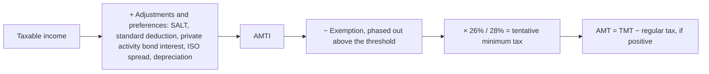

## Self-employment tax

```worked
title: SE tax for a freelancer
scenario: |
  Tara has 2025 Schedule C net profit of $80,000 and no wages.
steps:
  - label: Net earnings from self-employment
    work: 80,000 × 92.35%
    result: 73,880
  - label: SE tax
    work: 73,880 × 15.3%
    result: 11,304 (rounded)
  - label: Deduction for AGI
    work: 50% × 11,304
    result: 5,652
insight: The 92.35% factor mimics the employer's deduction for its half of FICA. If Tara also had wages, the 12.4% Social Security portion would apply only up to the wage base remaining after her wages.
```

```check
reg-ot-chk1
```

## Alternative minimum tax



| Adjustment or preference | Why it's added back |
|---|---|
| State and local taxes deducted | Not deductible for AMT |
| Standard deduction | Not allowed for AMT |
| Interest on private activity bonds | Taxable for AMT (a preference) |
| Bargain element on exercise of ISOs | Income for AMT (timing difference) |
| Accelerated depreciation differences | AMT uses slower methods for some property |

AMT caused by timing items (such as ISOs) creates a **minimum tax credit** that can offset regular tax in later years.

## Other taxes and estimated payments

| Tax | Rate | Threshold (2025) |
|---|---|---|
| Additional Medicare tax | 0.9% | Wages + SE income over $200,000 single / $250,000 joint |
| Net investment income tax | 3.8% | Lesser of NII or MAGI over $200,000 / $250,000 |
| Kiddie tax | Parents' rate | Child's unearned income over $2,700 |

```check
reg-ot-chk2
```
