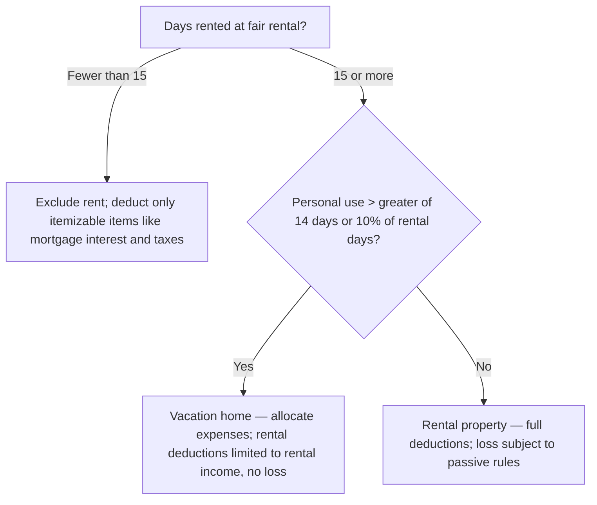

## Schedule C deductions

| Expense | Treatment |
|---|---|
| Business meals with clients (not lavish) | 50% deductible |
| Entertainment (sporting events, golf) | Not deductible |
| Fines and penalties paid to a government | Not deductible |
| Business gifts | Deductible up to $25 per recipient per year |
| Self-employed health insurance | Deductible for AGI (not on Schedule C) |
| Half of self-employment tax | Deductible for AGI |
| Start-up costs | $5,000 immediately (phased out above $50,000), rest over 180 months |

```check
reg-bri-chk1
```

## Vacation and rental homes



## Loss limitations — in order

```worked
title: Can Priya deduct her rental loss?
scenario: |
  Priya, single, has MAGI of $120,000 (wages). She owns a rental condo, actively participates (approves tenants and
  sets rent), and has a $30,000 loss. She has no other passive income, and she is fully at risk.
steps:
  - label: At-risk limit
    work: Fully at risk
    result: Loss passes to the passive activity rules
  - label: Special allowance
    work: 25,000 − 50% × (120,000 − 100,000)
    result: 15,000
  - label: Deductible this year
    work: Lesser of the 30,000 loss or the 15,000 allowance
    result: 15,000
  - label: Suspended loss
    work: 30,000 − 15,000
    result: 15,000 carried forward — usable against future passive income or released on sale
insight: The allowance phases out by $1 for every $2 of MAGI above $100,000, so it's gone at $150,000.
```

```faded
title: Your turn
scenario: |
  Evan (MAGI $136,000) actively participates in a rental with a $20,000 loss and has no other passive income.
steps:
  - label: Allowance after the phase-out
    answer: 7000
    solution: 25,000 − 50% × 36,000 = 7,000
  - label: Suspended loss
    answer: 13000
    solution: 20,000 − 7,000 = 13,000
```

```check
reg-bri-chk2
```
