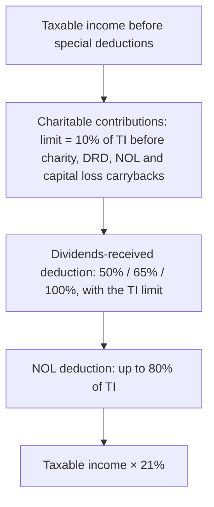

## From book income to taxable income

```worked
title: Schedule M-1 style reconciliation
scenario: |
  Harbor Tech's 2025 book net income is $500,000. Book income includes: federal income tax expense $110,000;
  municipal bond interest $8,000; premiums on key-person life insurance (Harbor is beneficiary) $4,000; business
  meals $10,000; a regulatory fine $3,000. Book depreciation is $60,000; tax depreciation is $90,000.
steps:
  - label: Add back federal income tax expense
    work: + 110,000
    result: 610,000
  - label: Subtract municipal interest
    work: − 8,000
    result: 602,000
  - label: Add nondeductible items
    work: + 4,000 premiums + 5,000 (50% of meals) + 3,000 fine
    result: 614,000
  - label: Depreciation difference
    work: − (90,000 − 60,000)
    result: 584,000 taxable income (before special deductions)
insight: Permanent differences never reverse; the depreciation difference is temporary and creates a deferred tax liability on the books.
```

```check
reg-cc-chk1
```

## Special corporate deductions — in order



```worked
title: Charitable limit and DRD
scenario: |
  Before charitable contributions and the DRD, Pine Corp. has taxable income of $300,000, which includes $100,000
  of dividends from a 30%-owned domestic corporation. It paid $40,000 to charity.
steps:
  - label: Charitable limit
    work: 10% × 300,000
    result: 30,000 deductible; 10,000 carries forward 5 years
  - label: Taxable income before DRD
    work: 300,000 − 30,000
    result: 270,000
  - label: DRD (65%)
    work: Lesser of 65% × 100,000 = 65,000 or 65% × 270,000 = 175,500
    result: 65,000
  - label: Taxable income
    work: 270,000 − 65,000
    result: 205,000 → tax 43,050 at 21%
insight: The DRD taxable income limit matters only when taxable income before the DRD is smaller than the dividend itself.
```

```check
reg-cc-chk2
```
