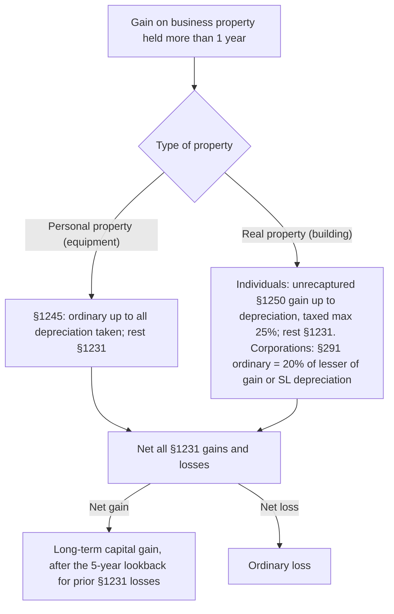

## Netting for individuals

```worked
title: Netting capital gains and losses
scenario: |
  Maya's 2025 transactions: short-term gain $4,000; short-term loss $9,000; long-term gain $15,000; long-term loss $2,000.
steps:
  - label: Net short-term
    work: 4,000 − 9,000
    result: (5,000) net short-term loss
  - label: Net long-term
    work: 15,000 − 2,000
    result: 13,000 net long-term gain
  - label: Net the two
    work: 13,000 − 5,000
    result: 8,000 net capital gain — eligible for long-term rates
insight: A net short-term loss absorbs long-term gain first. If the overall result were a loss, only $3,000 would be deductible this year.
```

```faded
title: Your turn — a net capital loss
scenario: |
  Leo has a short-term gain of $2,000, a long-term loss of $12,000, and no other capital transactions.
steps:
  - label: Net capital loss
    answer: 10000
    solution: 12,000 − 2,000 = 10,000 net long-term loss
  - label: Deductible against ordinary income this year
    answer: 3000
    solution: Limited to $3,000
  - label: Carryforward to next year
    answer: 7000
    solution: 10,000 − 3,000 = 7,000, carried forward as long-term
```

```check
reg-cg-chk1
```

## Business property: recapture and §1231



```worked
title: Characterizing gains on business property
scenario: |
  An individual sole proprietor sells two assets held for years.
steps:
  - label: "Equipment: cost 100,000; depreciation 60,000; sold for 120,000"
    work: Gain 80,000; §1245 recapture = lesser of gain or depreciation = 60,000
    result: 60,000 ordinary; 20,000 §1231
  - label: "Building: cost 500,000; straight-line depreciation 150,000; sold for 600,000"
    work: Gain 250,000; unrecaptured §1250 gain = 150,000
    result: 150,000 taxed at up to 25%; 100,000 §1231
  - label: "If a C corporation sold the same building"
    work: §291 = 20% × lesser of 250,000 gain or 150,000 depreciation
    result: 30,000 ordinary; 220,000 §1231
insight: Recapture only ever reaches depreciation taken — gain above the original cost is always §1231.
```

```check
reg-cg-chk2
```
