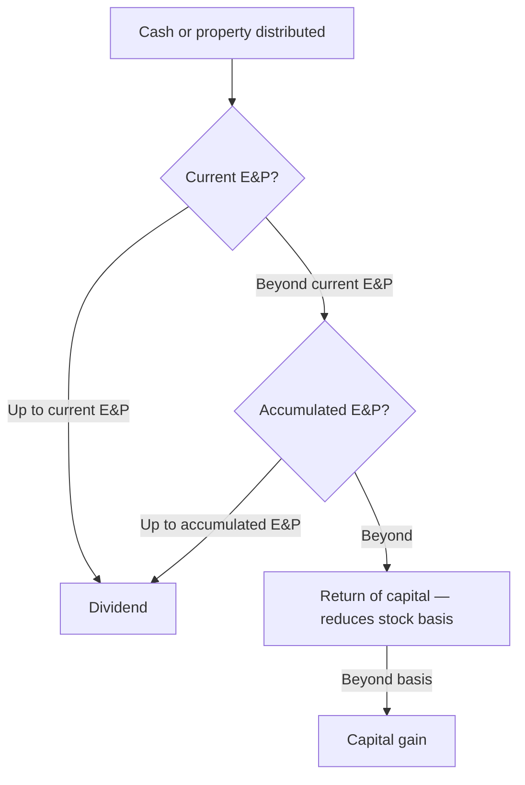

## Current E&P

```worked
title: From taxable income to current E&P
scenario: |
  Oak Corp.'s 2025 taxable income is $400,000 (tax $84,000). It had $10,000 of municipal interest, a $26,000 DRD,
  $6,000 of disallowed meals (50%), a $4,000 fine, and tax depreciation exceeding E&P depreciation by $20,000.
steps:
  - label: Start with taxable income
    work: 400,000
    result: 400,000
  - label: Add tax-exempt income, the DRD, and excess tax depreciation
    work: + 10,000 + 26,000 + 20,000
    result: 456,000
  - label: Subtract federal income tax and nondeductible expenses
    work: − 84,000 − 6,000 − 4,000
    result: 362,000 current E&P
insight: E&P measures economic ability to pay dividends, so it adds back tax-only deductions and subtracts real outflows the tax law ignores.
```

```check
reg-ep-chk1
```

## How a distribution is taxed



## Property distributions

```worked
title: Distributing appreciated land
scenario: |
  Elm Corp. (ample E&P) distributes land to its sole shareholder: FMV $90,000, adjusted basis $50,000, subject to a
  $20,000 mortgage the shareholder assumes.
steps:
  - label: Corporation's gain
    work: 90,000 − 50,000
    result: 40,000 recognized (as if sold)
  - label: Shareholder's dividend
    work: 90,000 − 20,000 liability assumed
    result: 70,000
  - label: Shareholder's basis in the land
    work: FMV
    result: 90,000
insight: If the land had been worth less than basis, Elm could not deduct the loss — a reason to sell loss property and distribute the cash instead.
```

```check
reg-ep-chk2
```
