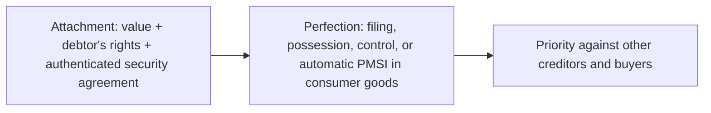

## Secured transactions



```worked
title: Who has priority?
scenario: |
  Harlan Co. buys equipment. Lender A filed a financing statement covering "all equipment" on March 1 and lent on
  March 10. Lender B lent on February 20 but filed on March 5. The seller of new equipment retains a PMSI, delivers
  the equipment June 1, and files June 15.
steps:
  - label: Lender A vs. Lender B (existing equipment)
    work: First to file or perfect — A filed March 1, B filed March 5
    result: A wins, even though B lent first
  - label: PMSI seller vs. Lenders A and B (new equipment)
    work: A PMSI in equipment perfected within 20 days after the debtor receives it
    result: The seller has priority in the new equipment (June 15 is within 20 days of June 1)
insight: Lending first doesn't win priority — filing or perfecting first does, except for a timely PMSI.
```

```check
reg-dc-chk1
```

## Bankruptcy

| Chapter | Who | What happens |
|---|---|---|
| 7 | Individuals and businesses | Trustee liquidates nonexempt assets; individuals receive a discharge |
| 11 | Mainly businesses | Debtor in possession proposes a reorganization plan |
| 13 | Individuals with regular income (within debt limits) | 3–5 year repayment plan |

**Preferential transfers** (the trustee can recover): (1) to or for a creditor, (2) for an antecedent debt, (3) while insolvent (presumed during the 90 days before filing), (4) within 90 days (1 year for insiders), (5) that lets the creditor receive more than in a Chapter 7 liquidation. Exceptions include contemporaneous exchanges for new value and payments in the ordinary course of business.

**Fraudulent transfers:** made with intent to hinder creditors, or for less than reasonably equivalent value while insolvent — reachable back 2 years under federal law.

## Suretyship

| Event | Effect on the surety |
|---|---|
| Creditor releases the principal debtor without reserving rights against the surety | Surety discharged |
| Creditor releases collateral | Surety discharged to the extent of the collateral's value |
| Material modification of the debt without the surety's consent | Surety discharged (compensated surety only if prejudiced) |
| Debtor's bankruptcy or incapacity | **Not** a defense for the surety |
| Creditor's fraud on the surety | Defense |

```check
reg-dc-chk2
```
