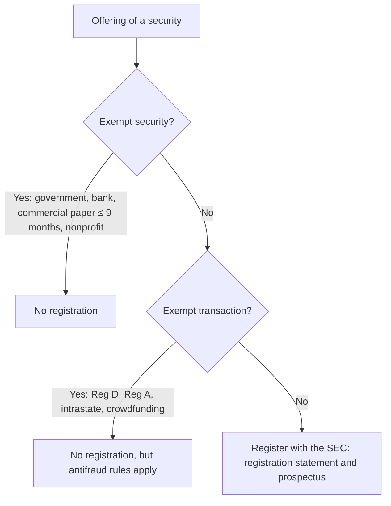

## Registering securities (1933 Act)



| Exemption | Maximum raised | Investors | General solicitation? |
|---|---|---|---|
| Rule 504 | $10 million / 12 months | Any | Generally no (state rules may allow) |
| Rule 506(b) | Unlimited | Unlimited accredited + up to 35 nonaccredited (sophisticated) | No |
| Rule 506(c) | Unlimited | Accredited only (verified) | Yes |
| Regulation A Tier 1 / Tier 2 | $20 million / $75 million | Any (Tier 2 limits for nonaccredited) | Yes ("testing the waters") |
| Intrastate (Rule 147/147A) | No federal cap | In-state residents | Limited |

**Accredited investors** include institutions, directors and executive officers of the issuer, and individuals with net worth over $1 million (excluding the primary residence) or income over $200,000 ($300,000 with a spouse) in each of the last two years.

```check
reg-fr-chk1
```

## Employment laws

```worked
title: Payroll taxes for one employee
scenario: |
  In 2025, Kai earns $60,000. The state unemployment credit is the full 5.4%.
steps:
  - label: Social Security — employee share
    work: 6.2% × 60,000
    result: 3,720 (employer matches 3,720)
  - label: Medicare — employee share
    work: 1.45% × 60,000
    result: 870 (employer matches 870)
  - label: FUTA — employer only
    work: (6.0% − 5.4%) × 7,000
    result: 42
insight: Employees never pay FUTA. The additional 0.9% Medicare tax applies only to wages over $200,000 and isn't matched by the employer.
```

| Law | Key rule |
|---|---|
| FLSA | Minimum wage; overtime at 1.5× over 40 hours/week (nonexempt employees) |
| ERISA | Fiduciary duties for plan managers; vesting schedules; no requirement to offer a plan |
| Workers' compensation | No-fault; exclusive remedy against the employer; not for intentional self-inflicted injuries |
| COBRA | 20+ employees; up to 18 months of continued coverage (36 for some events); employee may pay up to 102% |
| FMLA | 50+ employees; 12 weeks unpaid leave for birth, adoption, or serious health conditions |
| Title VII / ADA / ADEA | Anti-discrimination (ADEA protects workers 40 and older) |

```check
reg-fr-chk2
```
