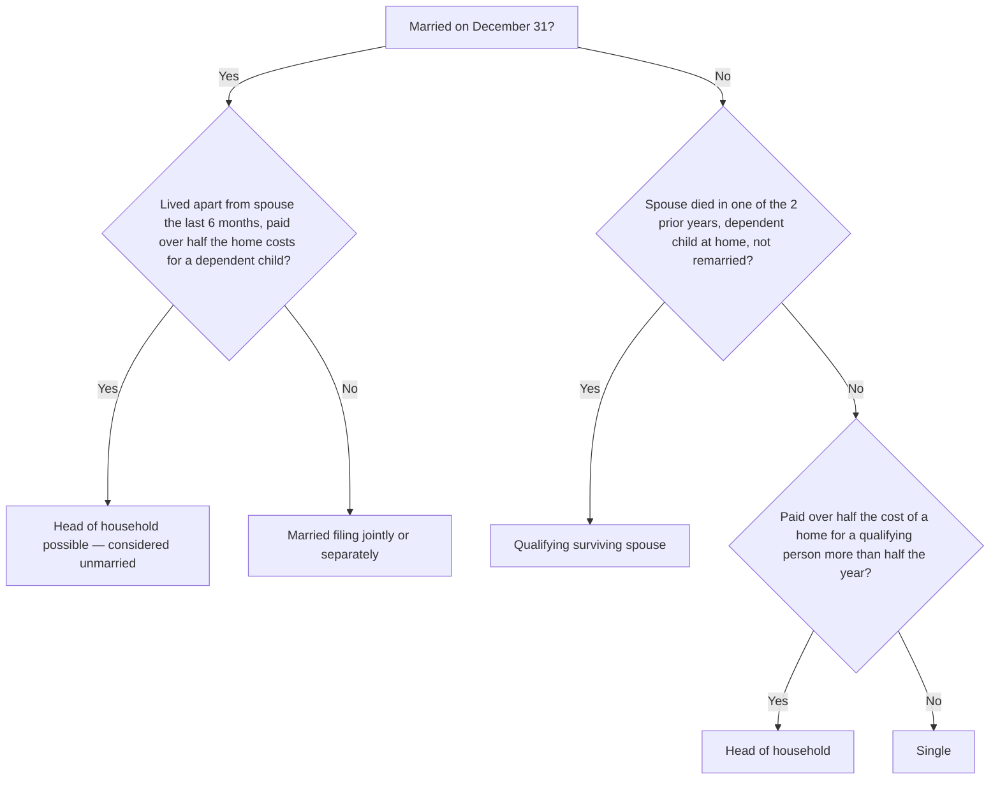

## Filing status decision



```check
reg-fs-chk1
```

## Qualifying child vs. qualifying relative

| Test | Qualifying child | Qualifying relative |
|---|---|---|
| Relationship | Child, stepchild, foster child, sibling, or a descendant of one | Broader relatives, or any household member who lived with the taxpayer all year |
| Age | Under 19, or under 24 if a full-time student (any age if disabled); younger than the taxpayer | None |
| Residency | Lived with the taxpayer more than half the year | Only for non-relatives (all year) |
| Support | Didn't provide more than half of own support | The taxpayer provides more than half (or a multiple support agreement) |
| Gross income | No limit | Less than $5,200 (2025) |

```worked
title: Who can be claimed?
scenario: |
  The Parks (married filing jointly) support several people in 2025.
steps:
  - label: Son, 22, full-time student, lived at home 9 months, earned $8,000 (didn't provide over half his support)
    work: Under 24 and a student; residency and support tests met
    result: Qualifying child — no gross income limit applies
  - label: Mrs. Park's mother, lives in her own apartment; the Parks pay 70% of her support; her gross income is $3,000 (plus nontaxable Social Security)
    work: Relative; gross income under $5,200; support over half
    result: Qualifying relative (and she needn't live with them)
  - label: A friend who lived with them all year; gross income $6,000
    work: Household member, but gross income exceeds $5,200
    result: Not a dependent
insight: Nontaxable income (such as most Social Security benefits) doesn't count toward the qualifying relative gross income limit.
```

## Standard deduction (2025)

| Filing status | Basic amount | Additional (65+ or blind, each) |
|---|---:|---:|
| Single | 15,750 | 2,000 |
| Married filing jointly / qualifying surviving spouse | 31,500 | 1,600 per spouse per condition |
| Married filing separately | 15,750 | 1,600 |
| Head of household | 23,625 | 2,000 |

For 2025–2028, individuals age 65 or older may also claim a separate deduction of up to $6,000 each (phased out at higher incomes), whether or not they itemize.

```check
reg-fs-chk2
```
