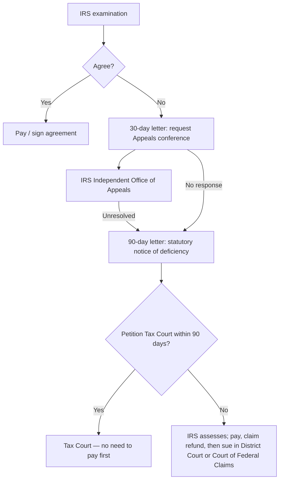

## The path of a dispute



| Court | Pay first? | Jury? | Appeals to |
|---|---|---|---|
| U.S. Tax Court | No | No | U.S. Court of Appeals (taxpayer's circuit) |
| U.S. District Court | Yes | Yes | U.S. Court of Appeals |
| U.S. Court of Federal Claims | Yes | No | Court of Appeals for the Federal Circuit |

```check
reg-irs-chk1
```

## Statutes of limitations

```worked
title: Can the IRS still assess?
scenario: |
  Four taxpayers filed Year 1 returns (due April 15, Year 2). Today is June 1, Year 5.
steps:
  - label: Ana filed March 1, Year 2; ordinary errors only
    work: 3 years from the due date (early returns are treated as filed on the due date) → April 15, Year 5
    result: Expired
  - label: Ben filed on time but omitted 30% of his gross income
    work: More than 25% omission → 6 years
    result: Open until April 15, Year 8
  - label: Cara filed a fraudulent return
    work: Fraud → no limit
    result: Open indefinitely
  - label: Dev filed late on October 1, Year 2
    work: 3 years from the actual filing date → October 1, Year 5
    result: Still open
insight: A return filed early is treated as filed on the due date; a late return starts the clock when it's actually filed.
```

**Refund claims:** file within the later of 3 years from when the return was filed or 2 years from when the tax was paid. The refund is limited to tax paid within the look-back period (3 years plus extensions, or 2 years).

## Sources of tax authority

| Source | Weight |
|---|---|
| Internal Revenue Code | Highest — statutory law |
| Final Treasury regulations | Force of law (legislative regulations especially) |
| Temporary regulations | Binding until replaced (expire after 3 years) |
| Proposed regulations | No authority — guidance only |
| Revenue rulings | IRS position on specific facts; can be relied on by taxpayers |
| Revenue procedures | Procedural guidance |
| Private letter rulings | Binding only for the taxpayer who requested them |

```check
reg-irs-chk2
```
