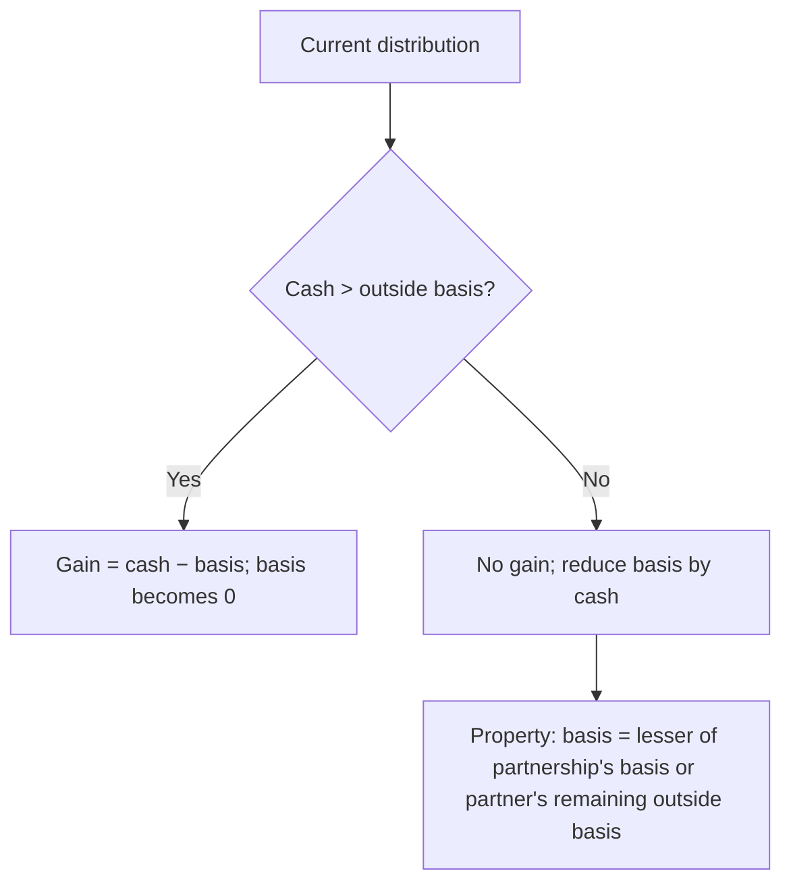

## Ordinary income vs. separately stated items

```worked
title: Allocating partnership items
scenario: |
  The AB Partnership (equal partners Ann and Ben) has 2025 sales $500,000, cost of sales $200,000, salaries to
  employees $80,000, a guaranteed payment to Ann of $40,000, long-term capital gain $10,000, charitable
  contributions $6,000, and municipal interest $2,000.
steps:
  - label: Ordinary business income
    work: 500,000 − 200,000 − 80,000 − 40,000 guaranteed payment
    result: 180,000 → 90,000 each
  - label: Separately stated
    work: LTCG 10,000; charity 6,000; municipal interest 2,000
    result: Each partner gets 5,000; 3,000; 1,000
  - label: Ann's income from the partnership
    work: 40,000 guaranteed payment + 90,000 ordinary + 5,000 LTCG (+ 1,000 exempt interest)
    result: 135,000 taxable (charity 3,000 is her itemized deduction)
insight: Items that could be treated differently on a partner's own return (capital gains, charity, §179) must be separately stated so they keep their character.
```

```check
reg-pt-chk1
```

## Outside basis

```worked
title: Ben's basis rollforward
scenario: |
  Ben's basis at January 1, 2025 is $50,000. His share of partnership liabilities increased by $8,000. Using the
  items above, he received $70,000 in cash distributions.
steps:
  - label: Add income items
    work: 50,000 + 90,000 ordinary + 5,000 LTCG + 1,000 exempt interest + 8,000 liabilities
    result: 154,000
  - label: Subtract nondeductible / separately stated deductions
    work: − 3,000 charitable contributions
    result: 151,000
  - label: Subtract distributions
    work: − 70,000
    result: 81,000 ending basis
insight: Tax-exempt income increases basis (so it's never taxed on distribution); nondeductible expenses decrease it.
```

## Distributions



```check
reg-pt-chk2
```

## Reviewing Form 1065 classification

Checklist for a prepared Schedule K:

- **Guaranteed payments** (including health premiums paid for a partner) are deducted in computing ordinary business income **and** reported separately on line 4.
- **Separately stated items** (interest, dividends, §1231, capital gains, §179, charity, tax-exempt income) stay out of ordinary income.
- **Self-employment earnings** (line 14a): a general partner's share of ordinary income plus guaranteed payments for services. A **limited partner's** distributive share is excluded; only guaranteed payments for services count.

**Resolving diagnostics.** Tax software raises a diagnostic whenever an entry looks unusual. It is a question, not an error. For each one, decide whether:

1. the **input is wrong** — fix the entry;
2. the entry is **right and the difference is expected** — clear the flag and document why; or
3. the source documents **cannot answer it** — ask the client.

Clearing a flag without understanding it is how errors reach a filed return.
