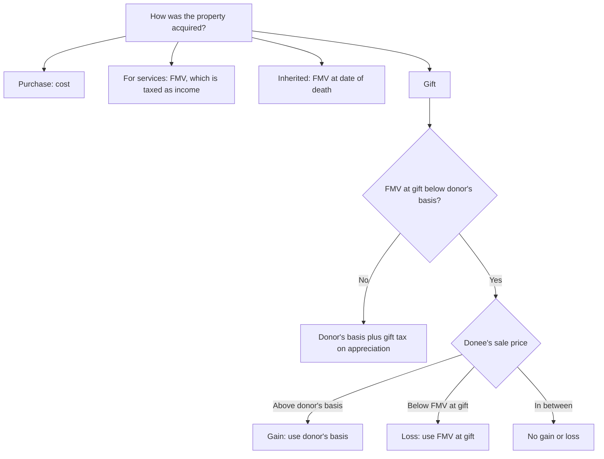

> **Tax year:** 2025 law. The core basis rules in this module were not changed by the One Big Beautiful Bill Act.

## The core equation

| Step | Formula |
|---|---|
| Amount realized | Cash + FMV of property received + debt relief − selling costs |
| Adjusted basis | Cost + improvements − depreciation |
| Realized gain (loss) | Amount realized − adjusted basis |
| Recognized gain (loss) | Realized, unless a rule defers or disallows it |

```check
reg-pb-chk2
```

## Basis depends on how you got it



```check
reg-pb-chk1
```

```worked
title: Gift of loss property — three possible sales
scenario: |
  Dana's basis in stock is $20,000. She gives it to Eli when its FMV is $15,000. Consider three possible sale prices.
steps:
  - label: Eli sells for $25,000
    work: Gain basis = donor's $20,000 → 25,000 − 20,000
    result: $5,000 gain; the holding period includes Dana's
  - label: Eli sells for $12,000
    work: Loss basis = FMV $15,000 → 12,000 − 15,000
    result: $3,000 loss; the holding period starts at the gift date
  - label: Eli sells for $17,000
    work: Above $15,000 (no loss) but below $20,000 (no gain)
    result: No gain or loss
insight: Test gain against the donor's basis first, then test loss against FMV. If neither produces a result, there is none.
```

## Gift tax adjustment (appreciated gifts)

Basis increase = gift tax paid × (net appreciation ÷ taxable amount of the gift). The taxable amount is the gift after the annual exclusion.

```faded
title: Your turn — gift with gift tax paid
scenario: |
  Donor's basis is $40,000; FMV at the gift is $100,000. The taxable gift after the annual exclusion is $80,000,
  and the donor paid $12,000 of gift tax on it.
steps:
  - label: Net appreciation
    answer: 60000
    solution: 100,000 − 40,000 = 60,000
  - label: Gift tax added to basis
    answer: 9000
    hint: 12,000 × 60,000 ÷ 80,000
    solution: 12,000 × 0.75 = 9,000
  - label: Donee's basis
    answer: 49000
    solution: 40,000 + 9,000 = 49,000 (never more than FMV)
```

## Loss disallowance rules

| Rule | Trigger | Consequence |
|---|---|---|
| **§267 related party** | Sale at a loss to family (spouse, siblings, ancestors, lineal descendants) or a >50%-owned entity | Seller's loss is disallowed. The buyer's later **gain** is reduced by the disallowed loss (it never creates a loss) |
| **§1091 wash sale** | Substantially identical securities bought within 30 days before or after a loss sale | Loss is disallowed and added to the basis of the new shares; the holding period tacks |

> **Trap:** In-laws are *not* related parties under §267, but siblings are.
