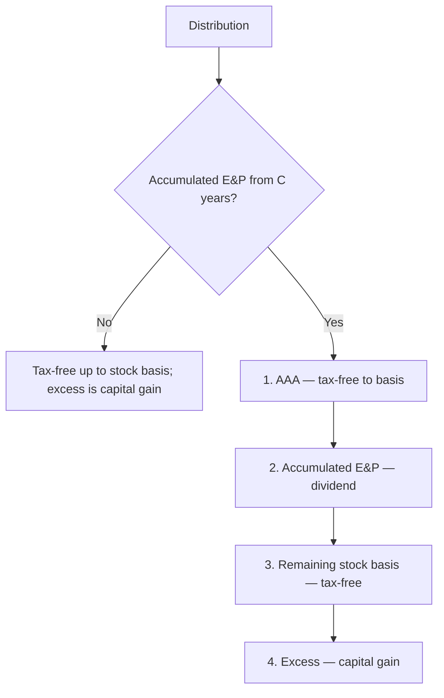

## Eligibility checklist

| Requirement | Traps |
|---|---|
| Domestic corporation | Certain financial institutions and insurance companies are ineligible |
| ≤ 100 shareholders | Family members may elect to count as one |
| Eligible shareholders | No partnerships, C corporations, or nonresident aliens |
| One class of stock | Differences in voting rights are allowed; differences in distribution or liquidation rights aren't |

```check
reg-sc-chk1
```

## Pro rata allocation and basis

```worked
title: Mid-year sale of stock
scenario: |
  Juno Inc. (calendar-year S corporation, 365 days) earns $73,000 of ordinary income in 2025. Kim owned 100% until
  she sold 50% to Leo on July 1 (Kim owns the stock for 181 days at 100% and 184 days at 50%).
steps:
  - label: Daily income
    work: 73,000 ÷ 365
    result: 200 per day
  - label: Kim's share
    work: 181 × 200 × 100% + 184 × 200 × 50%
    result: 36,200 + 18,400 = 54,600
  - label: Leo's share
    work: 184 × 200 × 50%
    result: 18,400
insight: Allocation is per share, per day — unless all affected shareholders elect to close the books at the sale date.
```

```faded
title: Your turn — loss limited by basis
scenario: |
  Mona's stock basis is $15,000, and she has loaned $10,000 directly to her S corporation. She also guaranteed a
  $50,000 bank loan to the corporation. Her share of the corporation's loss is $40,000.
steps:
  - label: Deductible loss (stock basis + debt basis)
    answer: 25000
    solution: 15,000 + 10,000 = 25,000 (the guarantee creates no basis)
  - label: Suspended loss carried forward
    answer: 15000
    solution: 40,000 − 25,000 = 15,000
```

## Distributions



```check
reg-sc-chk2
```
