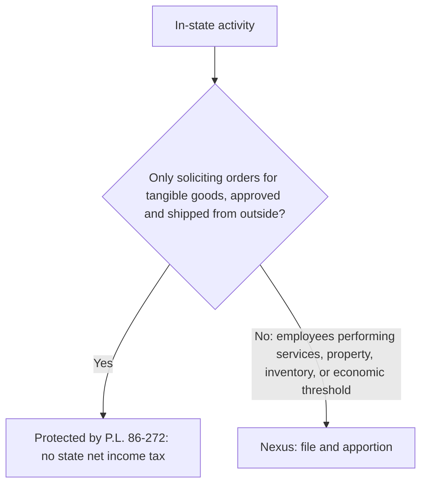

> **Scope:** REG tests the concepts and the computation. Planning a multistate footprint is in TCP (`Multistate taxation`).

## Nexus



```check
reg-slt-chk2
```

## From federal to state taxable income

1. Start with federal taxable income (before the NOL and special deductions in many states).
2. **Add** state and local income taxes deducted federally and interest on other states' municipal bonds.
3. **Subtract** interest on U.S. Treasury obligations (states can't tax it) and other state-specific items.
4. Remove **nonbusiness income**; it is allocated, not apportioned.
5. Multiply the remaining **business income** by the apportionment percentage.
6. Add the nonbusiness income **allocated** to this state.

## Apportionment

```worked
title: Three-factor apportionment
scenario: |
  Brookline Corp. has $2,000,000 of apportionable business income and $80,000 of rent from investment land
  located in State A. Its State A factors: sales $3,000,000 of $10,000,000; property $1,200,000 of $6,000,000;
  payroll $900,000 of $3,000,000. State A uses an equally weighted three-factor formula.
steps:
  - label: Factors
    work: Sales 30%; property 20%; payroll 30%
    result: 30%, 20%, 30%
  - label: Apportionment percentage
    work: (30% + 20% + 30%) ÷ 3
    result: 26.67%
  - label: Apportioned business income
    work: 2,000,000 × 26.67%
    result: 533,333
  - label: State A taxable income
    work: 533,333 + 80,000 rent allocated to State A, where the land is
    result: 613,333
insight: With a double-weighted sales factor the percentage would be (2 × 30% + 20% + 30%) ÷ 4 = 27.5%; with a single sales factor, 30%.
```

```check
reg-slt-chk1
```
