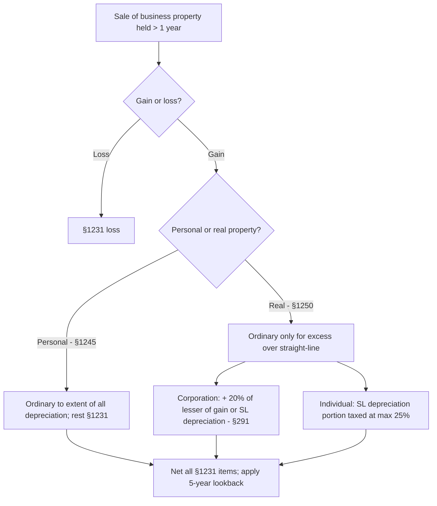

## Character of gain on a business asset



```worked
title: A corporation sells a building and equipment
scenario: |
  Oak Corp sells: (1) equipment, cost $200,000, accumulated depreciation $150,000, for $90,000; (2) a building held
  10 years, cost $1,000,000, straight-line depreciation $250,000, for $1,100,000.
steps:
  - label: Equipment gain
    work: 90,000 − 50,000 basis
    result: 40,000 — all §1245 ordinary (less than 150,000 depreciation)
  - label: Building gain
    work: 1,100,000 − 750,000 basis
    result: 350,000
  - label: §291 ordinary income
    work: 20% × lesser of 350,000 or 250,000
    result: 50,000 ordinary
  - label: §1231 gain on the building
    work: 350,000 − 50,000
    result: 300,000
insight: An individual selling the same building would have no ordinary recapture, but 250,000 of the gain would be unrecaptured §1250 gain taxed at up to 25%.
```

```check
tcp-ad-chk1
```

## The lookback

```faded
title: Your turn — §1231 netting with lookback
scenario: |
  In 2025, an individual has a §1231 gain of $50,000 on land and a §1231 loss of $(10,000) on equipment (no
  recapture). In 2022, she deducted a net §1231 loss of $(15,000); she has had no §1231 gains since.
steps:
  - label: Net §1231 gain for 2025
    answer: 40000
    solution: 50,000 − 10,000 = 40,000
  - label: Recharacterized as ordinary income (lookback)
    answer: 15000
    solution: Prior 5 years' nonrecaptured net §1231 losses = 15,000
  - label: Long-term capital gain
    answer: 25000
    solution: 40,000 − 15,000 = 25,000
```

```check
tcp-ad-chk2
```
