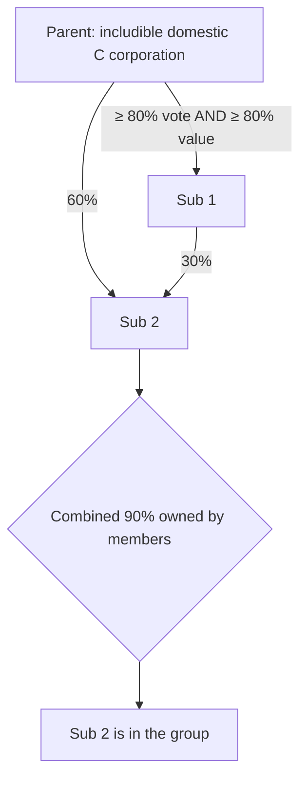

## Who can join



```check
tcp-cr-chk1
```

```worked
title: Intercompany sale
scenario: |
  Parent sells land (basis $100,000) to its 100% subsidiary for $160,000 in 2025. In 2027, the subsidiary sells
  the land to an unrelated buyer for $190,000. The group files consolidated returns.
steps:
  - label: 2025 gain recognized by the group
    work: Parent's 60,000 intercompany gain is deferred
    result: 0
  - label: Subsidiary's gain in 2027
    work: 190,000 − 160,000
    result: 30,000
  - label: Parent's deferred gain taken into account in 2027
    work: 60,000
    result: 60,000
  - label: Total group gain in 2027
    work: 30,000 + 60,000
    result: 90,000 — the same as if the parent had sold the land outside the group directly
insight: Consolidation treats the group like one company — nothing is recognized until the property leaves the group.
```

```check
tcp-cr-chk2
```

## Consolidated taxable income

- Combine each member's separate taxable income (with intercompany items deferred and intercompany dividends eliminated).
- Apply group-level items: consolidated NOL, capital gains and losses, §1231, charitable contributions (10% of consolidated TI), and the DRD for dividends from outside the group.
- One 21% tax on the total.
