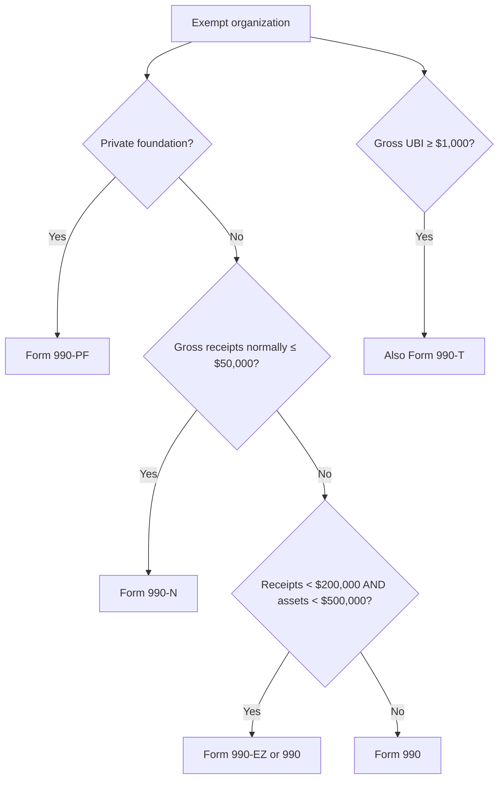

## Which return?



```check
tcp-eo-chk1
```

## Unrelated business taxable income

```worked
title: UBTI with exclusions
scenario: |
  A §501(c)(3) hospital reports: a public pharmacy selling to walk-in customers, gross profit $90,000 and direct
  expenses $30,000; dividends on its endowment $50,000; a thrift shop selling donated clothing, profit $20,000;
  and an annual volunteer-run fundraiser, profit $8,000.
steps:
  - label: Unrelated business (public pharmacy)
    work: 90,000 − 30,000
    result: 60,000
  - label: Excluded items
    work: Dividends (passive), donated goods, volunteer-run activity
    result: 0
  - label: Specific deduction
    work: − 1,000
    result: 59,000 UBTI
  - label: Tax (corporate rate)
    work: 21% × 59,000
    result: 12,390 — file Form 990-T
insight: Ask three questions — trade or business? regularly carried on? substantially related? A "no" to any means no UBTI.
```

```faded
title: Your turn — debt-financed property
scenario: |
  A university owns an office building (not used for exempt purposes) with average acquisition indebtedness of
  $600,000 and average adjusted basis of $1,500,000. Net rental income is $100,000.
steps:
  - label: Debt/basis percentage
    answer: 40
    solution: 600,000 ÷ 1,500,000 = 40%
  - label: Debt-financed income included in UBTI
    answer: 40000
    hint: Rents are normally excluded, but not the debt-financed share
    solution: 40% × 100,000 = 40,000
```

```check
tcp-eo-chk2
```
