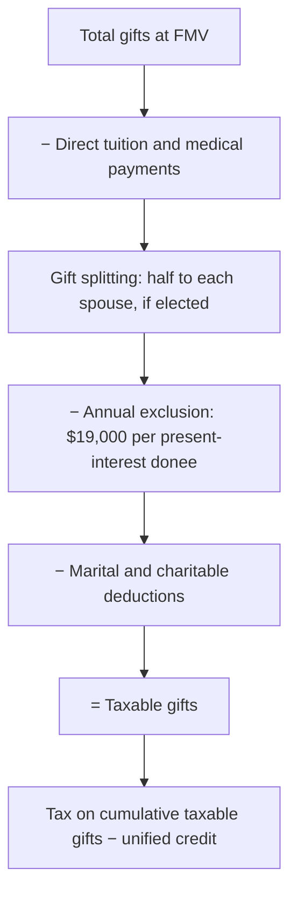

> **Tax year:** 2025. The basic exclusion amount is $13,990,000 for 2025 and $15,000,000 for 2026 (P.L. 119-21).

## From total gifts to taxable gifts



```worked
title: Taxable gifts for a single donor
scenario: |
  In 2025 Grace (unmarried) gives: $30,000 cash to her son; $15,000 cash to her niece; $45,000 paid directly to
  her grandson's university for tuition; $100,000 to a public charity; and stock worth $60,000 to an irrevocable
  trust for her granddaughter, with income accumulated until the granddaughter turns 25 (no Crummey power).
steps:
  - label: Son
    work: 30,000 − 19,000
    result: 11,000
  - label: Niece
    work: 15,000 is under the exclusion
    result: 0
  - label: Tuition paid directly and charity
    work: Excluded / deducted in full
    result: 0
  - label: Trust for granddaughter (future interest — no annual exclusion)
    work: 60,000
    result: 60,000
  - label: Taxable gifts
    work: 11,000 + 60,000
    result: 71,000 — Form 709 required; no tax due because of the unified credit
insight: The annual exclusion depends on the donee having an immediate right to the property. A trust that accumulates income gives only a future interest.
```

```check
tcp-gt-chk1
```

## Basis of gifted property

| FMV at gift vs donor's basis | Basis for gain | Basis for loss |
|---|---|---|
| FMV ≥ donor's basis | Donor's basis (+ gift tax on appreciation) | Same |
| FMV < donor's basis | Donor's basis | FMV at date of gift |

```faded
title: Your turn — the dual-basis rule
scenario: |
  Hal gives his sister stock with a basis of $20,000 and FMV of $14,000. No gift tax is paid. Compute her
  result if she sells for (a) $25,000, (b) $10,000, (c) $17,000.
steps:
  - label: (a) Gain on sale at $25,000
    answer: 5000
    solution: 25,000 − 20,000 donor basis = 5,000 gain
  - label: (b) Loss on sale at $10,000
    answer: 4000
    hint: Use FMV at the date of the gift for losses
    solution: 14,000 − 10,000 = 4,000 loss
  - label: (c) Gain or loss on sale at $17,000
    answer: 0
    solution: Using 20,000 gives a loss; using 14,000 gives a gain — so neither is recognized
```

```check
tcp-gt-chk2
```
