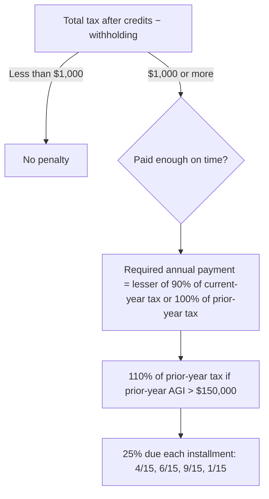

> **Tax year:** 2025 law, including One Big Beautiful Bill Act changes (see REVIEW.md for amounts to confirm).

## Estimated tax: paying as you go



```worked
title: Required annual payment for a high-income client
scenario: |
  Dana's 2024 tax was $40,000 on AGI of $220,000. She expects 2025 tax of $60,000. Her employer will withhold
  $30,000 in 2025. How much must she pay in estimates to be safe?
steps:
  - label: 90% of current-year tax
    work: 90% × 60,000
    result: 54,000
  - label: Prior-year safe harbor (AGI over $150,000)
    work: 110% × 40,000
    result: 44,000
  - label: Required annual payment
    work: Lesser of 54,000 or 44,000
    result: 44,000
  - label: Estimates needed
    work: 44,000 − 30,000 withholding
    result: 14,000 total, or 3,500 per quarter
insight: The prior-year safe harbor is usually the easiest target when income is rising — it is known on January 1.
```

```check
tcp-ip-chk1
```

## Timing and bunching

| When the client expects… | Income | Deductions |
|---|---|---|
| Same or lower rates next year | Defer (e.g., delay a year-end bonus, use installment sale) | Accelerate (pay deductible expenses in December) |
| Higher rates or income next year | Accelerate (e.g., Roth conversion now) | Defer |
| Itemized deductions near the standard deduction | — | Bunch into alternating years (donor-advised fund) |

```faded
title: Your turn — bunching charitable gifts
scenario: |
  Lee (single, 2025 standard deduction $15,750) has $8,000 of SALT and $6,000 of mortgage interest every year and
  gives $6,000 a year to charity. Compare giving $6,000 each year with giving $12,000 in 2025 and nothing in 2026.
  Assume the same standard deduction in 2026.
steps:
  - label: Itemized deductions each year without bunching
    answer: 20000
    solution: 8,000 + 6,000 + 6,000 = 20,000 (itemize both years)
  - label: Two-year total deductions without bunching
    answer: 40000
    solution: 20,000 × 2 = 40,000
  - label: 2025 itemized deductions with bunching
    answer: 26000
    hint: Add both years of gifts to 2025
    solution: 8,000 + 6,000 + 12,000 = 26,000
  - label: Two-year total with bunching (2026 is the larger of itemized or standard)
    answer: 41750
    hint: 2026 itemized would be 14,000, so take the standard deduction
    solution: 26,000 + 15,750 = 41,750 — 1,750 more deductions than giving evenly
```

```check
tcp-ip-chk2
```

## Surtaxes that shape planning

- **NIIT (3.8%)** applies to interest, dividends, capital gains, rents, royalties, and passive business income — not wages, active business income, IRA distributions, or tax-exempt interest. Base = lesser of NII or MAGI over the threshold.
- **Additional Medicare tax (0.9%)** applies to wages and self-employment income over the threshold. Employers withhold it only on wages over $200,000, regardless of filing status.
- **Kiddie tax:** shifting investments to a child only helps up to $2,700 of unearned income (2025); above that, the parents' rate applies.
