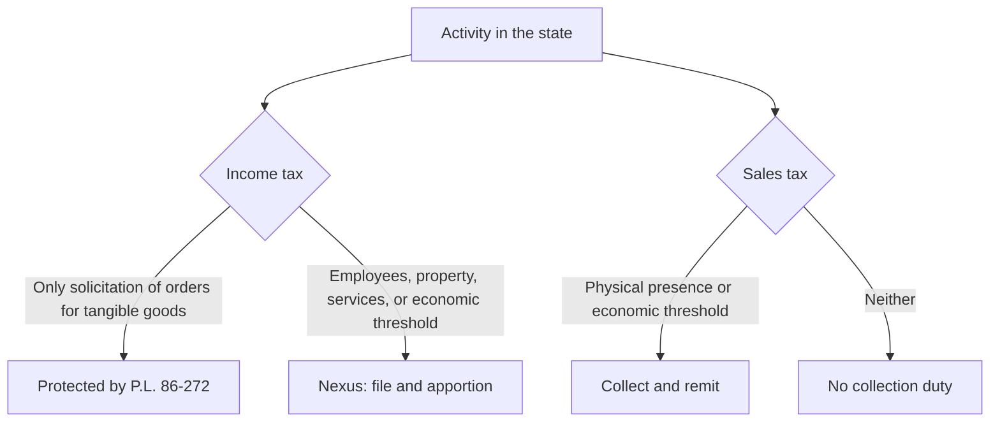

## Does the state have nexus?



```check
tcp-ms-chk1
```

## Apportionment

```worked
title: Three-factor vs single-sales-factor
scenario: |
  Delta Corp's total business income is $2,000,000. State X factors: sales $3M of $10M; property $6M of $12M;
  payroll $2M of $5M.
steps:
  - label: Factor percentages
    work: Sales 30%; property 50%; payroll 40%
    result: —
  - label: Equally weighted three-factor
    work: (30 + 50 + 40) ÷ 3
    result: 40% → 800,000 taxed by State X
  - label: Double-weighted sales
    work: (30 × 2 + 50 + 40) ÷ 4
    result: 37.5% → 750,000
  - label: Single sales factor
    work: 30%
    result: 600,000
insight: A company with property and payroll concentrated in a state but sales spread nationally pays less to that state under a sales-only formula.
```

```faded
title: Your turn — throwback
scenario: |
  Echo Co. ships from its only warehouse in State A. Sales: $4M to State A customers; $3M to State B (where Echo
  has nexus); $3M to State C (where Echo is protected by P.L. 86-272). State A uses a single sales factor with a
  throwback rule.
steps:
  - label: State A sales numerator ($ millions)
    answer: 7
    hint: Sales into a state where Echo isn't taxable are thrown back
    solution: 4 + 3 (thrown back from C) = 7
  - label: State A apportionment percentage
    answer: 70
    solution: 7 ÷ 10 = 70%
```

```check
tcp-ms-chk2
```
