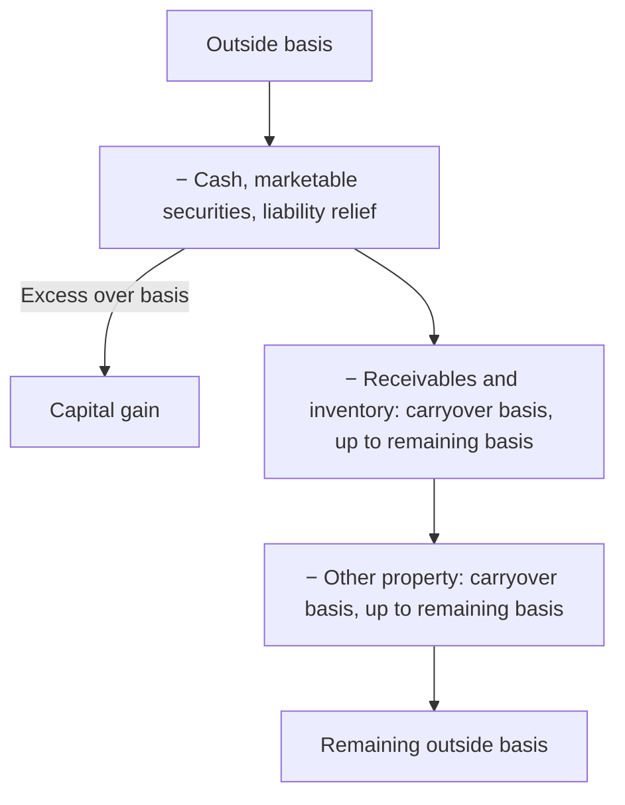

## Current distributions — the order



```worked
title: A current distribution of cash and land
scenario: |
  Dee's outside basis is $50,000. She receives a current distribution of $20,000 cash and land with a
  partnership basis of $45,000 (FMV $60,000).
steps:
  - label: Cash first
    work: 50,000 − 20,000
    result: 30,000 remaining; no gain
  - label: Land takes carryover basis, limited to remaining outside basis
    work: Lesser of 45,000 or 30,000
    result: 30,000 basis in the land
  - label: Dee's outside basis after the distribution
    work: 30,000 − 30,000
    result: 0
insight: In a current distribution the partner never recognizes a loss and never steps up property basis.
```

```check
tcp-pd-chk1
```

## Liquidating distributions

```faded
title: Your turn — liquidation with a stepped-up asset
scenario: |
  Eli's outside basis is $70,000. In complete liquidation he receives $10,000 cash, inventory (partnership basis
  $15,000), and equipment (partnership basis $20,000).
steps:
  - label: Basis after cash
    answer: 60000
    solution: 70,000 − 10,000 = 60,000; no gain
  - label: Basis of inventory
    answer: 15000
    solution: Carryover 15,000 (never stepped up)
  - label: Basis of equipment
    answer: 45000
    hint: Other property absorbs all remaining basis in a liquidation
    solution: 60,000 − 15,000 = 45,000
  - label: Loss recognized
    answer: 0
    solution: None — he received property other than money, receivables, and inventory
```

```check
tcp-pd-chk2
```

## Selling an interest

| Step | Computation |
|---|---|
| Amount realized | Cash + buyer's assumption of seller's share of liabilities |
| − Adjusted outside basis (including share of income to the sale date) | |
| = Total gain | |
| Ordinary portion (§751) | Seller's share of hot-asset FMV − share of hot-asset basis |
| Capital portion | Total gain − ordinary portion |
