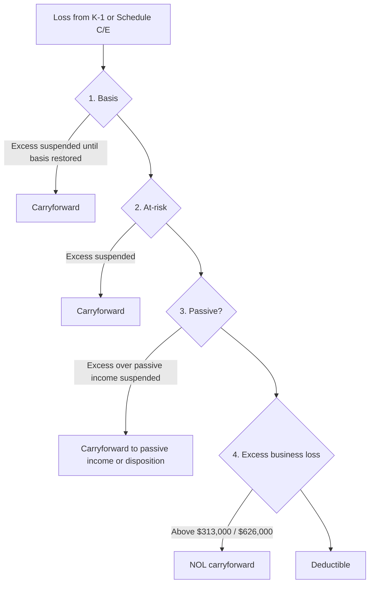

## Four gates, in order



```worked
title: The $25,000 rental allowance with a phase-out
scenario: |
  Tom (single) owns a rental house he actively manages (approves tenants, sets rent). The rental loss is $22,000.
  His MAGI is $120,000, and he has no passive income.
steps:
  - label: Maximum allowance
    work: 25,000
    result: 25,000
  - label: Phase-out
    work: 50% × (120,000 − 100,000)
    result: 10,000 reduction
  - label: Allowance
    work: 25,000 − 10,000
    result: 15,000 deductible against wages
  - label: Suspended loss
    work: 22,000 − 15,000
    result: 7,000 carried forward
insight: Active participation is a low bar — making management decisions counts — but it requires at least a 10% ownership interest.
```

```check
tcp-pa-chk1
```

## Vacation homes (§280A)

| Rental days | Personal use days | Treatment |
|---|---|---|
| Fewer than 15 | Any | Rent is tax-free; no rental expenses deductible (mortgage interest and taxes still itemized) |
| 15 or more | ≤ greater of 14 days or 10% of rental days | Rental property; loss allowed subject to passive rules |
| 15 or more | > greater of 14 days or 10% of rental days | Personal residence; expenses allocated to rental; deductions limited to rental income |

```faded
title: Your turn — mixed-use home
scenario: |
  A beach house is rented 90 days and used personally 30 days. Rental income $12,000. Mortgage interest and
  property taxes $9,000; utilities and maintenance $6,000; depreciation (if the whole year were rental) $7,500.
  Use the IRS days-used allocation (90 ÷ 120).
steps:
  - label: Rental percentage
    answer: 75
    solution: 90 ÷ 120 = 75%
  - label: Rental share of interest and taxes
    answer: 6750
    solution: 75% × 9,000 = 6,750
  - label: Rental share of utilities and maintenance
    answer: 4500
    solution: 75% × 6,000 = 4,500
  - label: Depreciation allowed
    answer: 750
    hint: Deductions can't exceed rental income; depreciation comes last
    solution: 12,000 − 6,750 − 4,500 = 750 of depreciation; the rest carries forward
```

```check
tcp-pa-chk2
```
