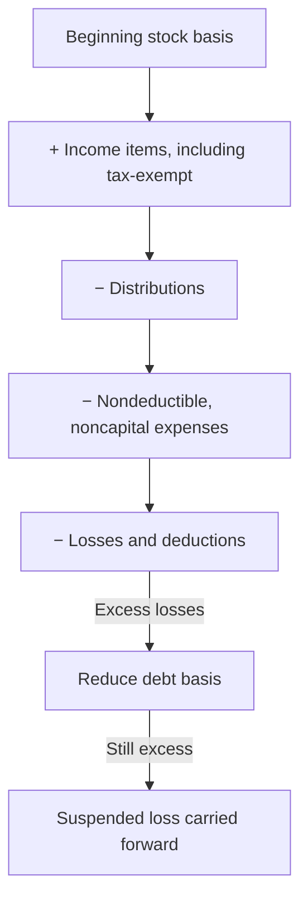

## Stock basis and debt basis



```worked
title: Loss limited by stock and debt basis
scenario: |
  Gia owns 100% of an S corporation. Beginning stock basis $20,000; she loaned the corporation $15,000 during the
  year. Her share: ordinary loss $(45,000); tax-exempt interest $2,000; no distributions.
steps:
  - label: Stock basis before loss
    work: 20,000 + 2,000
    result: 22,000
  - label: Loss absorbed by stock basis
    work: 22,000
    result: Stock basis 0
  - label: Loss absorbed by debt basis
    work: Lesser of remaining 23,000 or 15,000
    result: 15,000; debt basis 0
  - label: Deductible loss and suspended loss
    work: 22,000 + 15,000 = 37,000 deductible
    result: 8,000 suspended
insight: Future income restores debt basis first, before stock basis — so a repayment of the loan before basis is restored produces gain.
```

```check
tcp-sc2-chk1
```

## Distributions from an S corporation with E&P

```faded
title: Your turn — the ordering rules
scenario: |
  An S corporation (formerly a C corporation) has AAA of $30,000 and accumulated E&P of $20,000 at year-end,
  before distributions. Its sole shareholder has stock basis of $50,000 (after current-year income). It
  distributes $60,000 cash.
steps:
  - label: Tax-free distribution from AAA
    answer: 30000
    solution: AAA of 30,000 → tax-free, reduces stock basis to 20,000
  - label: Dividend from accumulated E&P
    answer: 20000
    solution: Next 20,000 from E&P is a dividend (doesn't reduce stock basis)
  - label: Remaining distribution
    answer: 10000
    hint: Applied against remaining stock basis
    solution: 60,000 − 30,000 − 20,000 = 10,000, tax-free return of basis
  - label: Ending stock basis
    answer: 10000
    solution: 50,000 − 30,000 − 10,000 = 10,000
```

```check
tcp-sc2-chk2
```

## Entity-level taxes

| Tax | When | Rate |
|---|---|---|
| Built-in gains (§1374) | Converted C corporation sells appreciated assets within 5 years | 21% of net recognized built-in gain |
| Excess net passive income (§1375) | Passive investment income > 25% of gross receipts + accumulated E&P | 21% |
| LIFO recapture | C corporation using LIFO converts to S | Tax on LIFO reserve, paid over 4 years |

## Reviewing a basis schedule (Form 7203)

Check the adjustments in the required order (Reg. 1.1367-1(f)):

1. **Increase** for contributions and all income items, **including tax-exempt income**.
2. **Decrease** for distributions (the AAA portion only; dividends out of AEP do not reduce basis).
3. **Decrease** for nondeductible expenses.
4. **Decrease** for losses and deductions — first stock basis, then **debt basis**.

What counts as **debt basis**: only loans the shareholder makes **directly** to the corporation. A guarantee of a bank loan creates no basis until the shareholder actually pays.

**Loan repayments.** A later year's *net* increase in basis restores debt basis before stock basis. If the corporation repays a loan while debt basis is still reduced, part of each payment is gain: repayment × (1 − debt basis ÷ face). The gain is capital on a formal note and ordinary on an open account. Planning point: repay only after basis is restored.

## Distributing AEP first: the §1368(e)(3) election

An S corporation that was once a C corporation may have accumulated E&P. Normally distributions come from AAA first (tax-free up to basis), then AEP (dividends). With the consent of all shareholders receiving distributions, the corporation can elect to distribute **AEP first**.

Why pay tax sooner? Once AEP is zero, the corporation can no longer owe the §1375 tax on excess passive investment income, or lose its S election under §1362(d)(3) after three years of passive investment income above 25% of gross receipts. When you compare the two alternatives, track the dividend income, the stock basis (only the AAA portion reduces it), and the AEP and AAA left afterwards.
