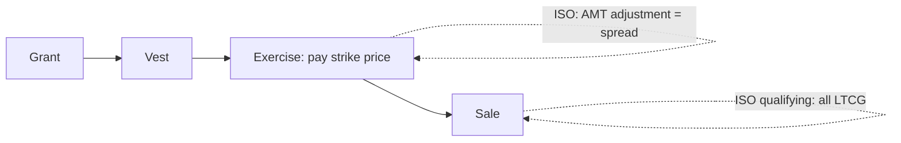

## Line up the dates



| | NQSO | ISO (qualifying) | Restricted stock (no 83(b)) |
|---|---|---|---|
| Grant | — | — | — |
| Vest / exercise | Ordinary income = spread | AMT adjustment only | Ordinary income at vesting |
| Sale | Capital gain/loss from FMV at exercise | LTCG from strike price | Capital gain/loss from FMV at vesting |
| Employer deduction | Yes, at exercise | None | Yes, at vesting |

```worked
title: ISO — qualifying vs disqualifying
scenario: |
  Rosa is granted ISOs on 1,000 shares at $20 on March 1, 2022. She exercises on June 1, 2024 when FMV is $50.
  Case A: she sells on July 1, 2025 at $80. Case B: she sells on December 1, 2024 at $80.
steps:
  - label: Case A holding periods
    work: More than 2 years from grant (3/1/2022) and more than 1 year from exercise (6/1/2024)
    result: Qualifying
  - label: Case A gain
    work: (80 − 20) × 1,000
    result: 60,000 LTCG; no ordinary income
  - label: Case B — sold within 1 year of exercise
    work: Ordinary income = lesser of (50 − 20) or (80 − 20), × 1,000
    result: 30,000 ordinary income
  - label: Case B remaining gain
    work: (80 − 50) × 1,000
    result: 30,000 short-term capital gain (held under 1 year after exercise)
insight: In the year of exercise, Rosa also has a $30,000 AMT adjustment if she still holds the shares at year-end.
```

```check
tcp-sc-chk1
```

## Restricted stock and §83(b)

```faded
title: Your turn — the §83(b) election
scenario: |
  On January 10, 2025, Jay receives 2,000 restricted shares (FMV $5) that vest on January 10, 2028, when FMV is
  expected to be $30. He pays nothing. He files a §83(b) election and sells at $30 right after vesting.
steps:
  - label: Ordinary income in 2025
    answer: 10000
    solution: 2,000 × $5 = 10,000 (included at transfer because of the election)
  - label: Ordinary income at vesting in 2028
    answer: 0
    hint: The election already reported the income
    solution: None — the election replaced the vesting-date inclusion
  - label: Capital gain on sale
    answer: 50000
    solution: 2,000 × (30 − 5) = 50,000 long-term (holding period began at transfer)
  - label: Ordinary income without the election
    answer: 60000
    solution: 2,000 × 30 = 60,000 at vesting
```

```check
tcp-sc-chk2
```

**Planning:** §83(b) makes sense when the current value is low and expected growth is high — it converts future appreciation to capital gain. The risk: tax paid now is not refunded if the shares are forfeited.
